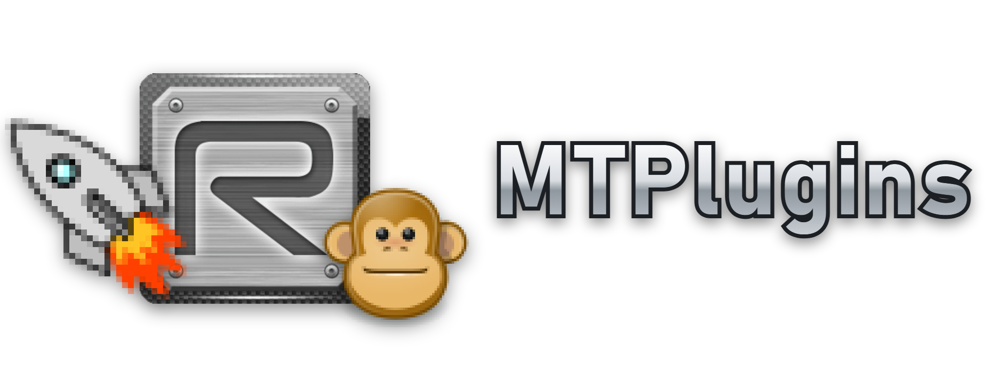

<p align="center"></p>

# MTPlugins plugin list

This repo holds `index.json`, the list that the **Browse plugins** view of the MTPlugins Plugins window (Ctrl+Shift+P in Radiant or APE) shows. Anyone can add their plugin with a pull request. Every entry is reviewed before it is merged.

MTPlugins' own plugins are not listed: they come with the MTPlugins installer, which also brings their updates.

Browse downloads each file of a plugin over HTTPS, checks it against the SHA-256 listed here, and only then puts it in `<game>\bin\plugins\<Name>\` and loads it. A file that does not match its hash is never installed.

## Add your plugin

1. Build your plugin with the MTPlugins SDK. The DLL must be named after the plugin (`MyTool.dll` for `"name": "MyTool"`).
2. Put the files where Browse can download them. Pick one:
   - **In this repo** (no hosting of your own, no source needed): the files go into `plugins/<Name>/<version>/` in your pull request. The script below copies them there.
   - **On your own GitHub release**: upload every file of your plugin folder as a release asset (`MyTool.dll`, optionally `MyTool.ini` and other files). Asset names are flat, so files in subfolders need unique names too.
3. Generate the entry, with the hashes, from your plugin folder:

   ```
   python tools/make_entry.py <your plugin folder> --version 1.0
   python tools/make_entry.py <your plugin folder> https://github.com/<you>/<repo>/releases/download/<tag>
   ```

   The first form copies the files into `plugins/MyTool/1.0/` and leaves out the file `url`s. The second points each file at your release.
4. Fill in the fields it leaves empty (`url` may stay empty or be removed), add the entry to the `plugins` array in `index.json`, and open a pull request. The check on the pull request compares every file with its hash (it downloads the ones with a `url`).

To publish a new version, open a pull request that raises `version` and updates the hashes: with files in this repo, run the script again with the new version (it adds the new `plugins/<Name>/<version>/` folder and removes the old one: only the listed version is kept, the check fails on any other folder); with a release, make a new release (never replace files in a release that is already listed) and update the URLs too. `changes` can say in one line what is new. Users then see "Update available" in the Plugins window, and the Mod Tools Launcher asks them at its next start whether to update (Update all / Skip / Later).

The version must go up whenever the files change: the editors compare it with the version your DLL reports (`api.version`), and a changed file without a newer version is shown as "Modified", never offered as an update. Bump `api.version` in the plugin too, to the same number.

## Entry format

```json
{
  "name": "MyTool",
  "displayName": "My Tool",
  "author": "you",
  "version": "1.0",
  "description": "One or two sentences.",
  "changes": "What is new in this version, one line.",
  "url": "https://github.com/you/MyTool",
  "apps": ["radiant"],
  "apiVersion": 1,
  "files": [
    { "path": "MyTool.dll", "url": "https://github.com/you/MyTool/releases/download/v1.0/MyTool.dll", "sha256": "..." },
    { "path": "MyTool.ini", "url": "https://github.com/you/MyTool/releases/download/v1.0/MyTool.ini", "sha256": "...", "config": true }
  ]
}
```

| Field | Meaning |
| ----- | ------- |
| `name` | the plugin's identifier: letters, digits, `_` or `-`; equal to the DLL name and to `api.name` in the plugin |
| `version` | numbers and dots (`1.0`, `1.2.3`); raise it with every new release, and keep it equal to `api.version` in the plugin; files kept in this repo sit in a folder of that name |
| `changes` | optional: one line (200 characters at most) about what is new in this version, shown in the update question |
| `apps` | the editors it runs in: `"radiant"`, `"ape"`, `"launcher"` |
| `apiVersion` | the `RADIANT_PLUGIN_API_VERSION` the plugin was built with |
| `url` | optional: the plugin's source or project page, shown as "Website" in the Plugins window; leave it out for a closed-source plugin with no public page |
| `files[].path` | where the file goes inside the plugin's folder; `/` for subfolders; must include `<name>.dll` |
| `files[].url` | optional: an `https://` download URL (release assets are fine: GitHub's redirect is followed); without it the file is taken from `plugins/<name>/<version>/<path>` in this repo |
| `files[].sha256` | the SHA-256 of that exact file, lowercase hex |
| `files[].config` | `true` for settings files: installed only when missing, so an update keeps the user's settings |

## Review rules

- Open source is welcome but not required. When `url` points to the source, the release files must be built from it.
- No plugin may download and run other code, or change files outside its own folder without asking the user.
- Plugins run inside the editor with the user's full rights, so a pull request that cannot be checked is not merged.
